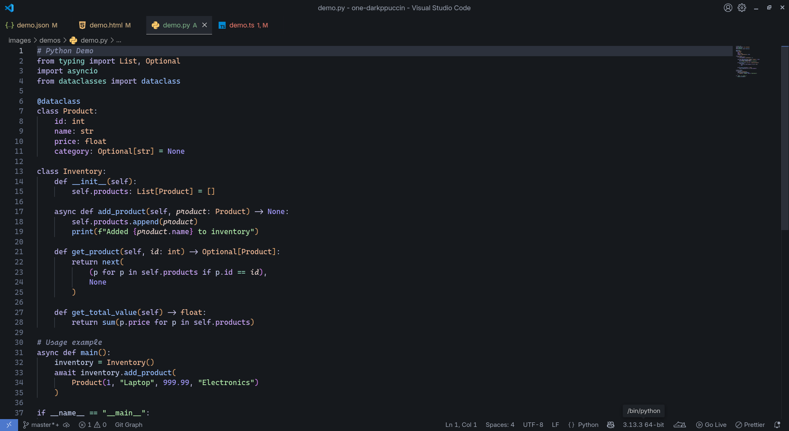

# One DarkPuccin

A VS Code theme inspired by the popular One Dark and Catppuccin color palettes. It aims to provide a visually appealing and comfortable coding experience.

## Features

- Dark, modern, and clean interface
- Two beautiful variants: Classic and Night
- Carefully selected colors for optimal readability and reduced eye strain
- Consistent theming across various UI elements and syntax highlighting

## Theme Variations

### 🌅 One DarkPuccin Classic

A perfect blend of One Dark and Catppuccin, offering a balanced and comfortable viewing experience for day-long coding sessions.

<em>TypeScript Example</em>

<em>Python Example</em>

<em>HTML/CSS Example</em>

<em>JSON Example</em>

### 🌙 One DarkPuccin Night

A darker variant perfect for late-night coding sessions, reducing eye strain while maintaining code readability.

<em>TypeScript Example (Night)</em>

<em>Python Example (Night)</em>

<em>HTML/CSS Example (Night)</em>

<em>JSON Example (Night)</em>

## Language Support

One DarkPuccin provides rich syntax highlighting for a wide range of programming languages, including but not limited to:

- TypeScript/JavaScript
- Python
- HTML/CSS
- JSON/YAML
- Markdown
- And many more!

## Installation

1. Open **Extensions** sidebar panel in VS Code. `View → Extensions`
2. Search for `One DarkPuccin`
3. Click **Install** to install it
4. Click **Reload** to reload the editor
5. Code > Preferences > Color Theme > Choose either:
   - 🌅 `One DarkPuccin Classic` for the classic experience
   - 🌙 `One DarkPuccin Night` for late-night coding

## Contributing

If you'd like to contribute to this theme, please visit the [GitHub repository](https://github.com/ni3rav/one-darkppuccin).

## Credits

- [One Dark Pro](https://github.com/Binaryify/OneDark-Pro)
- [Catppuccin](https://github.com/catppuccin/vscode)

## License

[MIT License](./LICENSE)

---

**Enjoy!** 💜😸
